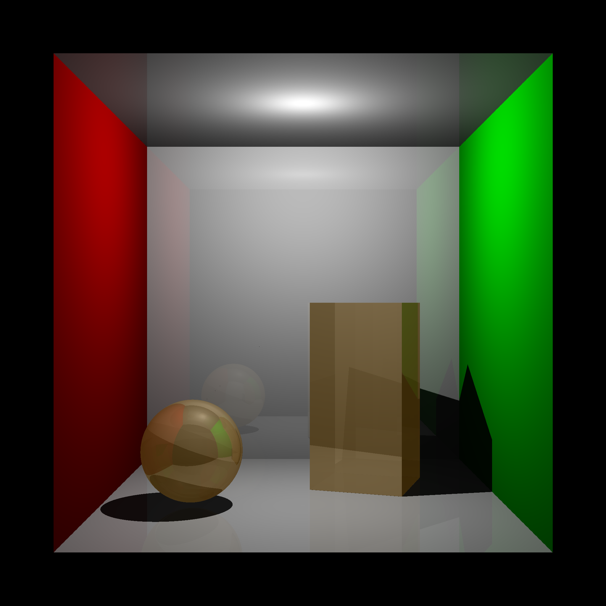
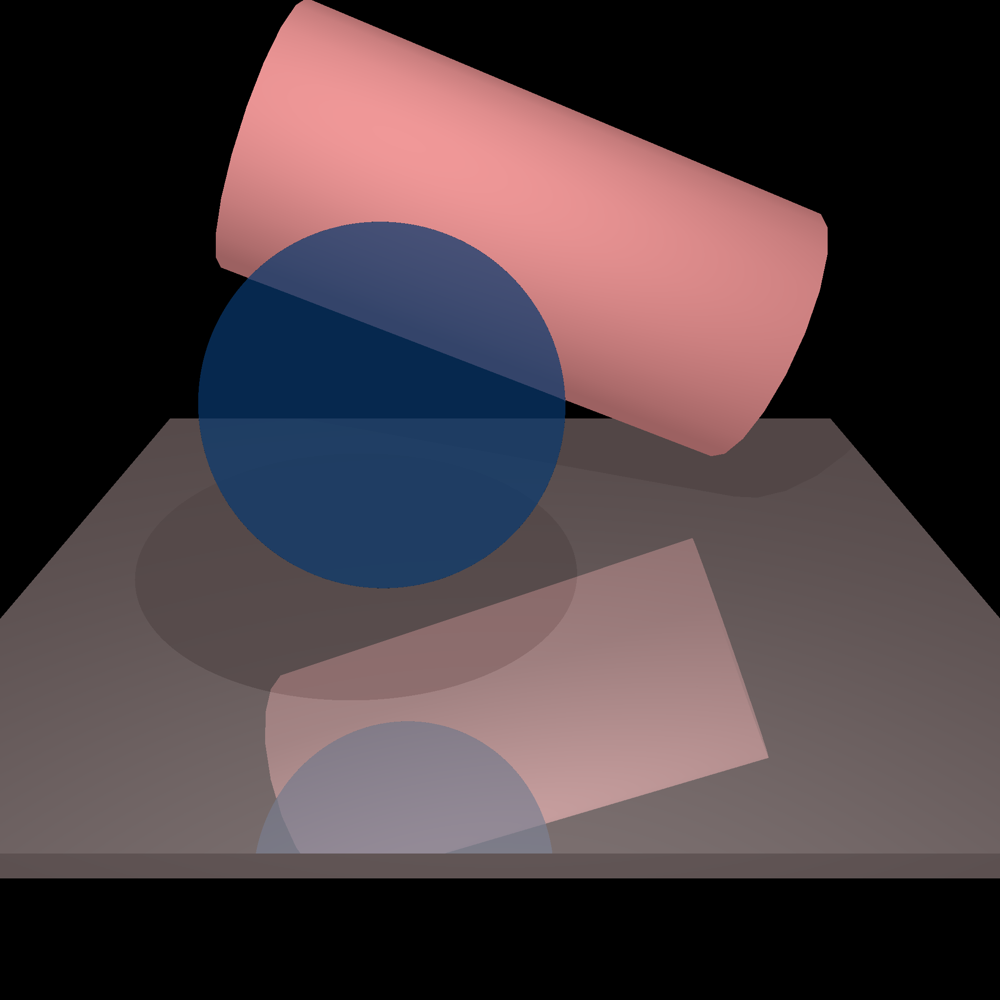
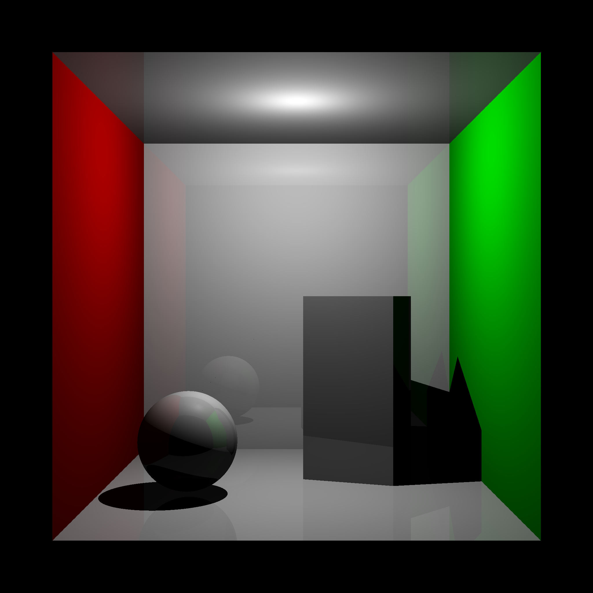
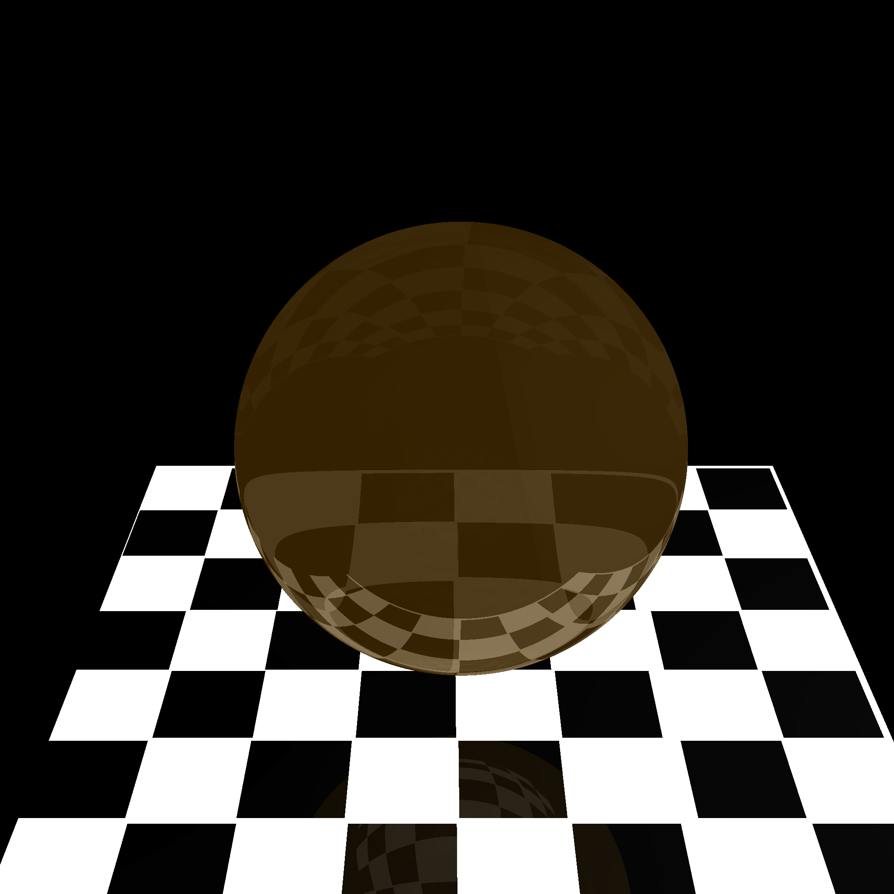

# Unity Artifacts

## Ray-traced Images

https://user-images.githubusercontent.com/117557584/201595490-70cef2ff-a736-4a00-9429-5f0495ae1692.mp4

I implemented a software ray tracer that renders a scene 
by calculating the color and intensity for each pixel. 
A ray is cast from the viewer, through the location of the pixel 
on the screen, into the scene, until it intersects with geometry 
in the scene.

At the point at which the ray intersects the scene, my code 
calculates the light intensity at that point according to 
the presence of light sources in the scene and shadow attenuation using 
the reflective and matte (specular and diffuse) characteristics of the material.
Another ray is recursively cast with direction dependent on the type of intersection
(usually a mirror reflection; for transparent objects, the ray is transmitted 
and bent according to Snell's law, or reflected when the conditions are met for 
total internal reflection).

Relevant code snippets for calculating shadow attenuation, 
specular and diffuse reflection, and reflection/refraction directions 
are included in the `code-snippets/` directory.

Videos of the ray tracer in operation are played back at 5-10x actual rendering speed.

https://user-images.githubusercontent.com/117557584/201595672-9ac9ee7d-48e8-4637-965b-2c3b77087668.mp4

https://user-images.githubusercontent.com/117557584/201595718-7169cdc8-38f1-400d-9aca-b3eac170442d.mp4

https://user-images.githubusercontent.com/117557584/201595742-69c39869-5948-4858-b04b-dd85da491d39.mp4
